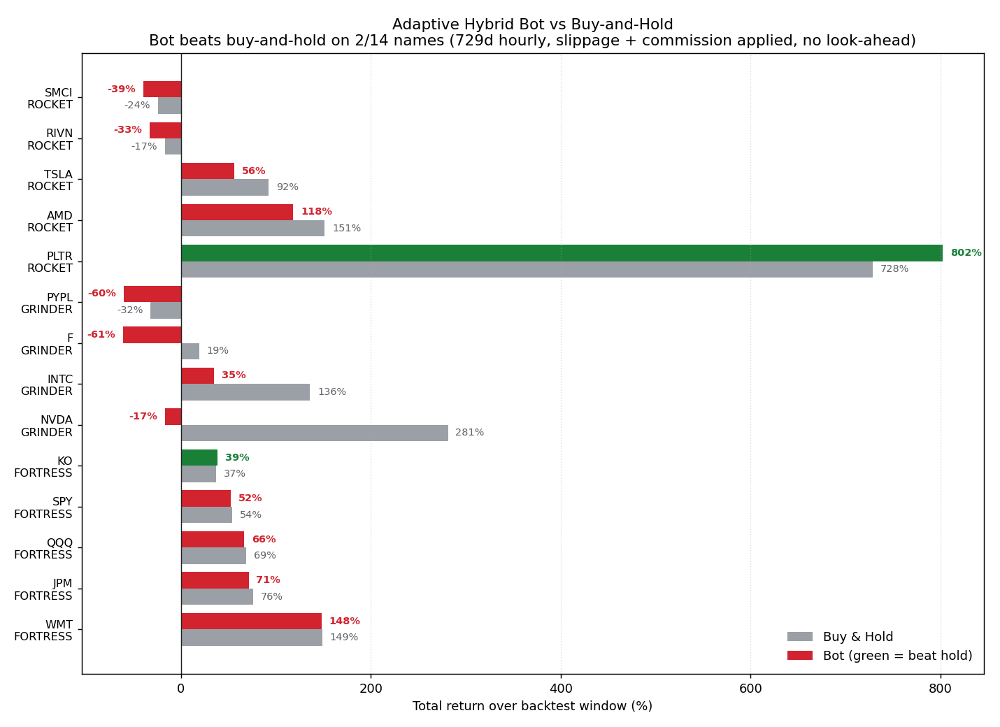
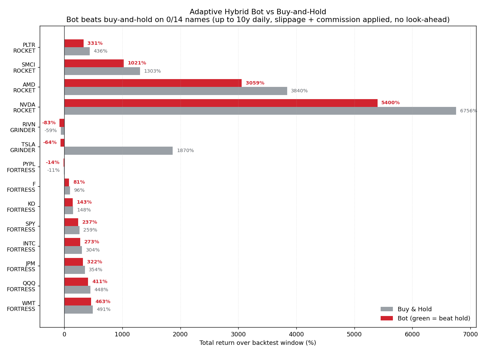
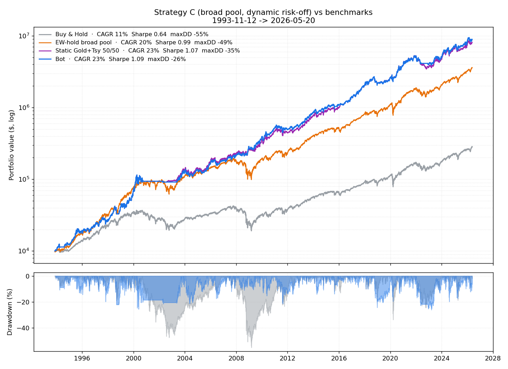
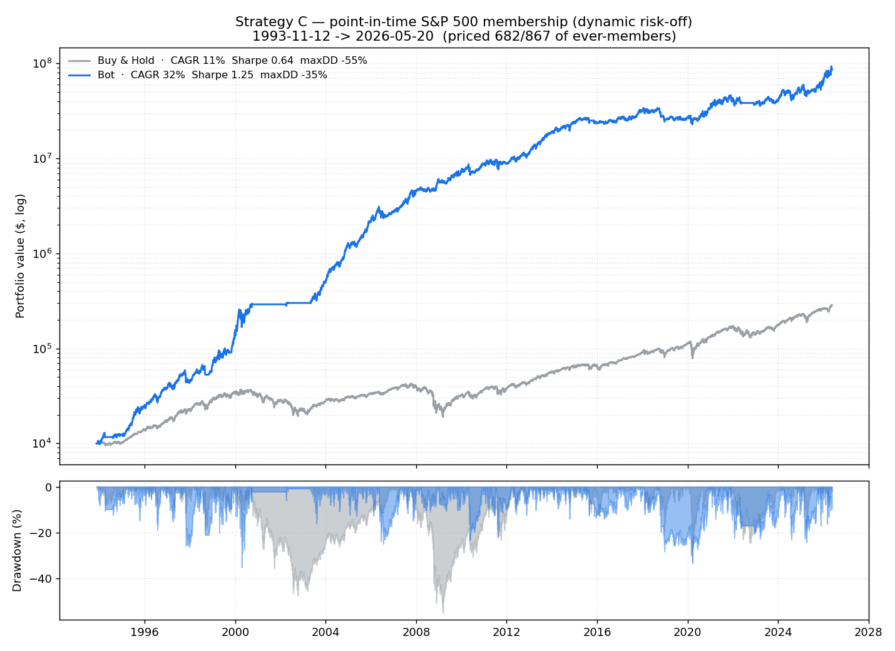

# 🤖 Adaptive Hybrid Trading Engine

A multi-regime backtesting and live-trading framework that classifies each asset by its volatility/trend profile, applies a different strategy to each class, and overlays a macro filter for global risk-on/risk-off conditions.

Built in Python around a clean four-layer architecture, with a Streamlit dashboard and an AES-encrypted trade journal synced to Google Drive.

> **Status:** Backtesting engine + Streamlit dashboard are working. Live execution via Charles Schwab API is wired but `DRY_RUN=True` by default.

---

## 📊 Results (honest backtest)

The same classify → route → macro-filter core runs in **two timeframe profiles**. They share one engine but operate on different bar cadences and horizons, which changes both the asset classifications and the trade frequency enough that they behave like two distinct strategies. Both apply **slippage + commission on every fill** and have **no look-ahead bias**. Reproduce with `python plot_results.py` and `python plot_results.py --long`.

### Comparison at a glance

| | **Strategy A — Tactical** | **Strategy B — Positional** |
|---|---|---|
| Bars / horizon | Hourly, ~729 days | Daily, up to 10 years |
| Option decay | per-hour | per-day (24×) |
| Warm-up | 1000 bars (~6 wks) | 250 bars (~1 yr) |
| **Beats buy-and-hold** | **2 of 14** | **0 of 14** |
| Median spread vs hold | −16% | −31% |
| Worst case | NVDA −298% | TSLA −1934% |

**The headline across both is a negative result — and that's the honest one.** The longer the horizon, the *worse* the active overlay does, because it's a persistent cost-and-timing drag with no compensating edge in a bull market. A naive backtest (look-ahead classification, zero costs) would have hidden this entirely.

### Strategy A — Tactical (hourly, ~2 years)



Wins on 2/14 (PLTR, KO). Raw numbers in [`results.csv`](results.csv).

| Ticker | Class | Bot | Buy & Hold | Δ vs hold | Trades |
|--------|-------|----:|-----------:|----------:|-------:|
| **PLTR** | 🚀 Rocket | **+802%** | +728% | **+74%** | 355 |
| AMD | 🚀 Rocket | +118% | +151% | −33% | 493 |
| TSLA | 🚀 Rocket | +56% | +92% | −36% | 541 |
| RIVN | 🚀 Rocket | −33% | −17% | −16% | 457 |
| SMCI | 🚀 Rocket | −39% | −24% | −15% | 549 |
| INTC | ⚔️ Grinder | +35% | +136% | −101% | 149 |
| NVDA | ⚔️ Grinder | −17% | +281% | −298% | 197 |
| F | ⚔️ Grinder | −61% | +19% | −80% | 209 |
| PYPL | ⚔️ Grinder | −60% | −32% | −28% | 167 |
| WMT | 🛡️ Fortress | +148% | +149% | −1% | 59 |
| JPM | 🛡️ Fortress | +71% | +76% | −4% | 58 |
| QQQ | 🛡️ Fortress | +66% | +69% | −2% | 57 |
| SPY | 🛡️ Fortress | +52% | +54% | −1% | 57 |
| **KO** | 🛡️ Fortress | **+39%** | +37% | **+2%** | 59 |

### Strategy B — Positional (daily, up to 10 years)



Wins on 0/14. Note the longer daily window **reclassifies** several names (e.g. NVDA reads as a Rocket, not a Grinder) and uses each ticker's full available history, so windows differ — PLTR/RIVN are younger than 10y. Raw numbers in [`results_10y.csv`](results_10y.csv).

| Ticker | Class | Bot | Buy & Hold | Δ vs hold | Trades | Since |
|--------|-------|----:|-----------:|----------:|-------:|-------|
| NVDA | 🚀 Rocket | +5400% | +6756% | −1356% | 361 | 2017 |
| SMCI | 🚀 Rocket | +1021% | +1303% | −281% | 380 | 2017 |
| AMD | 🚀 Rocket | +3059% | +3840% | −781% | 439 | 2017 |
| PLTR | 🚀 Rocket | +331% | +436% | −105% | 265 | 2021 |
| TSLA | ⚔️ Grinder | **−64%** | **+1870%** | **−1934%** | 311 | 2017 |
| RIVN | ⚔️ Grinder | −83% | −59% | −24% | 119 | 2022 |
| F | 🛡️ Fortress | +81% | +96% | −15% | 223 | 2017 |
| INTC | 🛡️ Fortress | +273% | +304% | −31% | 213 | 2017 |
| PYPL | 🛡️ Fortress | −14% | −11% | −3% | 202 | 2017 |
| KO | 🛡️ Fortress | +143% | +148% | −5% | 227 | 2017 |
| JPM | 🛡️ Fortress | +322% | +354% | −32% | 237 | 2017 |
| WMT | 🛡️ Fortress | +463% | +491% | −28% | 227 | 2017 |
| SPY | 🛡️ Fortress | +237% | +259% | −22% | 241 | 2017 |
| QQQ | 🛡️ Fortress | +411% | +448% | −37% | 239 | 2017 |

### What both runs tell us

- **The active overlay is a permanent tax, and taxes compound.** 🛡️ Fortress names (90% buy-and-hold) track the index but always land a few points *behind* — the active 10% sleeve plus costs never helps. Over 10 years that small drag compounds into a wider gap.
- **The 100%-active ⚔️ Grinder sleeve is a time bomb in a bull market.** With no buy-and-hold anchor, the bot is free to short or sit out compounding winners. Holding TSLA returned +1870%; trading it returned −64%. Betting against a stock that goes up 19× is financially fatal.
- **The conclusion is robust, not a modeling quirk.** The Fortress and Grinder names trade plain stock with no options at all, and they *still* underperform — so the gap is real strategy behavior, not an artifact of the approximate synthetic-options model.

The point of this project was never "I built a money printer." It was building a backtester I can *trust* — see *Engineering decisions* below for the look-ahead and cost bugs I had to remove before these numbers meant anything. The honest finding: **in a sustained bull market, a mean-reversion overlay loses to buy-and-hold, and loses worse the longer it runs.**

---

## 🟢 Strategy C — the version that actually wins

If mean-reversion fights the trend, **do the opposite.** Strategy C (`strategy_c.py`) is long-only, trend-following, and regime-gated — it holds by default and only sits out when the regime turns. One ranking brain combines every signal:

1. **Market regime gate** — leave equities when SPY is below its 200-day SMA.
2. **Per-name trend filter** — a name is eligible only if it's above its own 200-day SMA *and* has positive 12-1 month momentum.
3. **Ranking brain** — eligible names scored by a z-blend of 12-1 momentum, 6-1 momentum, and trend strength.
4. **Top-N selection** + **inverse-volatility sizing** (each holding contributes ~equal risk).
5. **Dynamic risk-off sleeve** — when defensive, hold gold/Treasuries *only while each is itself trending up*, else cash ("flight to what's working").
6. **Monthly rebalance** with costs charged on turnover.

Risk-adjusted "winning" is judged on **Sharpe and max drawdown**, not raw return — see [`metrics.py`](metrics.py). Reproduce with `python strategy_c.py`.

### Broad 65-name pool, 1993–2026 (the dynamic risk-off sleeve wins outright)



| Strategy | CAGR | Sharpe | Max DD | Calmar |
|---|---:|---:|---:|---:|
| **Strategy C — dynamic risk-off** | 23.2% | **1.09** | **−26%** | **0.89** |
| Strategy C — cash sleeve | 20.9% | 1.03 | −28% | 0.74 |
| EW-hold of the *same* 65 names | 19.8% | 0.99 | −49% | 0.40 |
| SPY buy & hold | 10.8% | 0.64 | −55% | 0.20 |

It beats SPY *and* equal-weight buy-and-hold of the **same names** — so the edge is the strategy, not the stock list. The dynamic sleeve earns gold/Treasury returns when they trend but bails to cash otherwise (dodging the 2022 bond crash), giving the **best return and the lowest drawdown at the same time**.

### Survivorship, peeled back layer by layer

Beating the market is easy to fake with hindsight. Watch the CAGR fall as each cheat is removed:

| Universe | CAGR | What it proves |
|---|---:|---|
| Today's full S&P 500, run backwards | 40.6% | **A trap** — secretly pre-loaded with future winners |
| **Point-in-time** S&P membership ([`run_sp500_pit.py`](run_sp500_pit.py)) | 32.2% | Selection hindsight removed (~8 pts of fake return gone) |
| 65-megacap pool vs EW-hold same names | ~23% | Survivorship-controlled by construction |



The point-in-time run reconstructs *who was in the index on each date* (from Wikipedia's change log) and only lets the bot pick from then-members. It could price **682 of 867** ever-members (79%); the missing 21% are delisted names (Lehman, Enron, Kodak…) that free data won't serve — the residual *price* survivorship. Notably, that residual matters far less here than for a buy-and-hold backtest: a **trend-following strategy exits dying names on their downturn rather than riding them to zero**, so it would have cut most of those losers anyway. The fully-clean number needs a delisted-price dataset (CRSP / Sharadar / Norgate).

**The robust, bias-proof takeaway:** across every universe, Strategy C delivers **Sharpe ~1.1–1.25 vs SPY's 0.64** and **drawdowns of −26% to −35% vs SPY's −55%.** That edge comes from the regime gate, which is universe-independent. The honest headline isn't "huge returns" — it's **roughly half the drawdown at nearly double the Sharpe.**

---

## 📰 Bot 2 — news, sentiment & industry linkage (in progress)

A second, complementary system that feeds *ideas* to the systematic core rather than trading on its own:

- **`news_sentiment.py`** — pluggable news ingestion (free yfinance source now; paid APIs droppable in later) + VADER sentiment scoring into a per-ticker signal.
- **`industry_map.py`** — thematic baskets + data-driven correlation peers ("who benefits from the SpaceX IPO?").
- **`live_picks.py`** — wires sentiment into Strategy C's live ranking as a modest tilt (the trend signal dominates; sentiment breaks ties).

**Honest status:** Bot 2 is a *live* signal, not yet backtestable — free news is recent-only, and an honest sentiment backtest needs point-in-time historical news (a paid dataset). Treat it as a tilt on the proven systematic core until validated.

---

## 🎯 The problem this solves

Most retail "trading bot" projects pick one strategy (trend-following or mean-reversion) and apply it to every ticker. That works for the subset of stocks that match the strategy, and silently loses money on the rest. A high-volatility momentum stock like NVDA needs different treatment than a choppy laggard like F, which needs different treatment than a low-vol blue chip like JPM.

This engine **classifies the asset first**, then chooses the strategy.

---

## 🧠 The "Sorting Hat" classifier

Each asset gets bucketed using a rolling-window calculation of **annualized volatility** and **Wilder's ADX** (trend strength):

| Identity   | Profile                           | Strategy                                                       | Core / Satellite |
|------------|-----------------------------------|----------------------------------------------------------------|------------------|
| 🚀 Rocket   | High vol (>35%) + strong trend (ADX > 25) | Trend-follow + synthetic 3× options on dips, RSI-based exits | 80% / 20%        |
| ⚔️ Grinder  | Mid vol (>20%) + choppy (ADX ≤ 25) | Mean-reversion: only longs above SMA200, only shorts below     | 0% / 100%        |
| 🛡️ Fortress | Low vol (<20%)                    | Buy-and-hold; deploys satellite cash only on deep dips          | 90% / 10%        |

Classification uses only data available **up to the start of the simulation** — no future leakage (this was a real bug; see *Engineering decisions* below).

---

## 🏗️ Architecture

```
┌──────────────────────────────────────────────────────────────┐
│                       senses (input)                         │
│  system_senses_stream.py  ·  senses_macro.py                 │
│  • Yahoo Finance OHLCV   • VIX, 10Y Treasury yields          │
└───────────────────────────┬──────────────────────────────────┘
                            ▼
┌──────────────────────────────────────────────────────────────┐
│                       brain (decide)                         │
│  system_strategy_evaluator.py  (routes by asset class)       │
│    ├── algo_stocks.py    (RSI + MACD + SMA50/200)            │
│    ├── algo_crypto.py    (SMA200 filter + RSI/MACD)          │
│    └── algo_forex.py     (Bollinger mean-reversion + RSI)    │
│  indicators.py           (one source of truth for math)      │
│  strategy_config.py      (shared thresholds for live + bt)   │
└───────────────────────────┬──────────────────────────────────┘
                            ▼
┌──────────────────────────────────────────────────────────────┐
│                       hands (execute)                        │
│  system_execution_client.py  (Charles Schwab API)            │
│  main.py                     (live loop)                     │
│  backtest_engine.py          (vectorized historical sim)     │
└───────────────────────────┬──────────────────────────────────┘
                            ▼
┌──────────────────────────────────────────────────────────────┐
│                  black box (audit trail)                     │
│  journal.py  →  AES-Fernet encrypted JSON → Google Drive     │
└──────────────────────────────────────────────────────────────┘
```

---

## 🔬 Engineering decisions worth highlighting

The interesting work on this project was **finding bugs in my own backtester** that were inflating returns. A backtest that runs cleanly is not the same as a backtest that's correct.

**1. Removed look-ahead bias in the classifier.** The original `classify_asset()` was called once at the start of the simulation using the *entire* dataframe — including data from the future. This meant the bot "knew" PLTR would turn into a Rocket years before the trade window opened. Refactored to `classify_asset_at(df, end_idx)` which only sees `df.iloc[end_idx - 1000 : end_idx]`. Reported returns dropped substantially; that's the point.

**2. Wired the macro regime filter into the backtest.** The `analyze_market_regime()` function (VIX/yield scoring) had been used by `main.py` (the live loop) for months but never by `backtest_engine.py`. Backtests were therefore not representative of what the live bot would actually do. Now both paths use the same scoring path.

**3. Added per-side slippage + commission.** Five bps slippage + one bp commission per side, applied on every fill — including option-position entries/exits and short-cover. For high-frequency Grinder strategies this is the difference between "winner" and "loser."

**4. Consolidated four duplicate RSI implementations** that had drifted apart. Three still used `.where()` (crash-prone on flat-price segments) while one had been patched to use `.clip()` + epsilon. Moved to a single `indicators.py` module.

**5. Replaced hardcoded encryption password** with an env-var-derived key and a randomly generated 16-byte salt. The original `password = b"my_super_secret_bot_password"` made the encryption theater — anyone with the source could decrypt the journal.

**6. Unified live and backtest thresholds.** `main.py` was using `total_score >= 4` while the backtest used `>= 3` for Rockets and `>= 4.5` for Grinders. Extracted both to `strategy_config.py` so a change moves them in lockstep.

---

## 🧰 Stack

`Python 3.10+` · `pandas` · `numpy` · `yfinance` · `streamlit` · `plotly` · `cryptography` (Fernet) · `schwab-py` · `google-api-python-client`

---

## 📁 Project structure

```
TradingBot/
├── backtest_engine.py          # Vectorized historical simulator
├── main.py                     # Live trading loop (DRY_RUN=True by default)
├── dashboard.py                # Streamlit GUI
├── indicators.py               # Shared technical-indicator math
├── strategy_config.py          # Thresholds + cost params (shared)
├── senses_macro.py             # VIX / TNX macro filter
├── system_senses_stream.py     # Live OHLCV fetcher
├── system_strategy_evaluator.py # Brain (asset-class router)
├── system_execution_client.py  # Schwab API client
├── algo_stocks.py / algo_crypto.py / algo_forex.py
├── journal.py                  # Encrypted Google Drive trade log
└── requirements.txt
```

---

## 🚀 Running it locally

```bash
# 1. Clone and install
git clone https://github.com/EriktheRed95/trading-bot.git
cd trading-bot
pip install -r requirements.txt

# 2. Set up the journal encryption key (one-time)
python -c "import secrets; print(secrets.token_urlsafe(32))"
# Windows (User scope, persists across shells):
[Environment]::SetEnvironmentVariable("TRADINGBOT_JOURNAL_KEY", "<paste-key>", "User")

# 3. Run a backtest across the default ticker list
python backtest_engine.py

# 4. Or launch the live dashboard
streamlit run dashboard.py
```

For **live execution** (still off by default), supply `schwab_keys.json` with your Schwab developer credentials and toggle `DRY_RUN=False` in `main.py`.

---

## 📉 Honest limitations

- **Yahoo Finance's hourly endpoint caps at ~730 days.** That's one walk-through per ticker; not enough for walk-forward validation. Real validation needs multi-decade daily data + a real walk-forward harness.
- **The synthetic-options model is approximate.** Constant 3× delta, fixed 0.17%/day theta, no IV, no spreads. Useful as a "what if I'd held a leveraged position" proxy; not a real options simulator.
- **No transaction logging or PnL attribution.** Trades print to console and (encrypted) go to the journal, but I don't aggregate them into a per-strategy PnL report yet.

---

## 🔭 Future work

- Replace yfinance with a proper data provider (Polygon, Alpaca, or Databento) for longer history and lower latency.
- Walk-forward backtest harness: train on a window, test on the next window, roll forward.
- Multi-ticker portfolio allocator: capital flows toward the top-N highest-ADX names each week.
- Alpaca paper-trading integration so the live loop has a forward-test channel without Schwab.
- Per-strategy PnL attribution and a "trade tape" in the dashboard.
